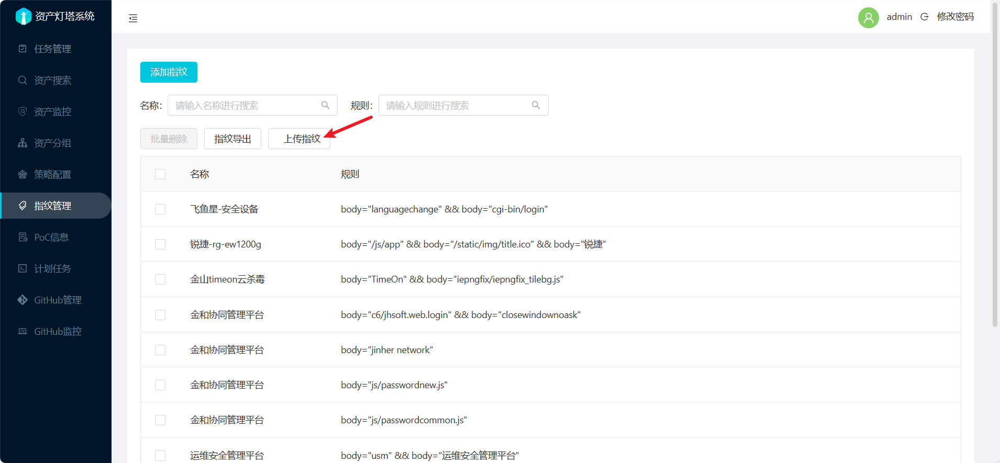
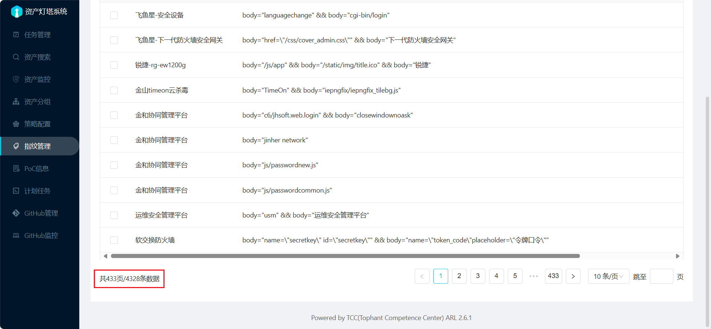

# ARL-Finger-ADD 本地处理版
由于 `ARL < 2.6.1` 版本的指纹模块只支持`逻辑或`匹配，误报率非常大，故没有添加指纹的意义

所以只适配ARL最新版 `2.6.1`

## 如何使用
```
python ARL-Finger-ADD.py
```

- 本地转换指纹库为`ARL灯塔`所支持的格式
- 运行后生成`EHole_ARL_finger.json`和`FingerprintHub_ARL_finger.json`文件
- 因为不同指纹库的指纹会有重复，所以处理完成后的两个指纹文件按需求选择（反正我是两个都用😋）

> PS: 本仓库的指纹库文件不会同步更新，请手动保持指纹库文件为最新版本


## 点击此处添加指纹👇


## 适配的指纹库
- [EHole](https://github.com/EdgeSecurityTeam/EHole) 自动去重后951条
- [FingerprintHub](https://github.com/0x727/FingerprintHub) 自动去重后3377条
> 共计4328条指纹



## 重要贡献
- <https://github.com/loecho-sec/ARL-Finger-ADD>
- <https://github.com/EdgeSecurityTeam/EHole>
- <https://github.com/0x727/FingerprintHub>